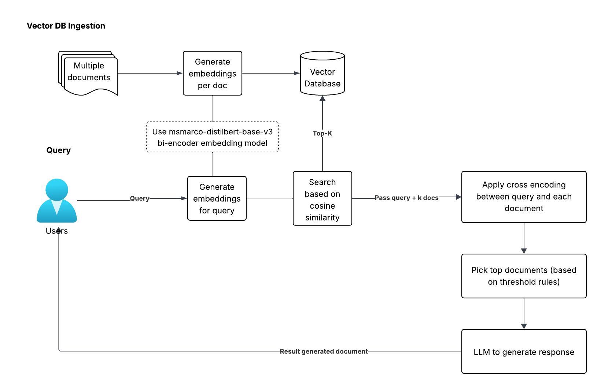

# 🎯 Precision RAG with Cross-Encoders — Basic Example

Improve the **precision of Retrieval-Augmented Generation (RAG)** by using cross-encoders to rerank retrieved passages. This repo provides a working example of how cross-encoding dramatically improves semantic filtering **after initial dense retrieval.**

> **Why this matters:**  
> You’ve embedded your documents and built a vector search pipeline. But your top-k hits are still noisy. That’s because standard bi-encoder RAG often retrieves *relevant-looking garbage*.  
> This example uses a cross-encoder scoring step to rerank results using **joint semantic attention**, improving downstream LLM output.



---

## 🔧 Prerequisites for Local Run

### 1. Create and activate a Python virtual environment:

```
python3 -m venv .rag-env
source .rag-env/bin/activate
pip install --upgrade pip
```

### 2. Install dependencies:

```
pip install "transformers[torch]" sentence-transformers faiss-cpu
```

---

## 🧪 Run a Minimal Cross-Encoder Reranking Demo

This script scores two passages against a query using both **bi-encoder similarity** and **cross-encoder relevance.**

```
export TRANSFORMERS_NO_TF=1
python basic_cross_encoding_example.py
```

### Sample Output:
```
Passage 1: Click on 'Forgot Password' on the login screen
  Bi-encoder score         : 0.6340
  Cross-encoder logit      : -2.2566
  Cross-encoder expit prob : 0.0948

Passage 2: Use a strong password with numbers and symbols
  Bi-encoder score         : 0.3121
  Cross-encoder logit      : -7.4544
  Cross-encoder expit prob : 0.0006
```

> In this case, Passage 1 is **150x more relevant** than Passage 2 by cross-encoder probability.  
> But 0.0948 is still a low absolute score—this means the passage is only **somewhat** relevant.

---

## 🧭 Decision Flow Using Cross-Encoder Output

Here’s how you might use this reranking in production:

1. ✅ If the top-ranked passage is **above a threshold**, pass it to the LLM for generation.
2. ⚠️ If all scores are below threshold, **fallback to traditional search** or notify the user.
3. 🛠️ If results are consistently poor, **augment the vector DB with better documents.**

---

## 🧬 Full Retrieval → Rerank → LLM Example

The more complete pipeline is in `detailed_cross_encoding_example.py`. It:

- Embeds and indexes 21 documents
- Retrieves top-5 passages using a bi-encoder
- Reranks using a cross-encoder with an expit threshold of `0.2`
- Runs LLM generation *only if* sufficient relevance is found

### Run it:

```
export TRANSFORMERS_NO_TF=1
python detailed_cross_encoding_example.py
```

### Sample Output:
Includes multiple queries and end-to-end flow with example LLM prompts and output.

> Queries that work well:
> - “tell me about canines”  
> - “AI and language processing”  
> - “what are small weasels”

> Queries that fail:
> - “unrelated query about astrophysics”  
> - “how do you handle special characters...”

You’ll see that **irrelevant results are filtered out entirely**, preventing garbage input to the LLM.

---

## 📊 Why This Matters

This basic demo shows you what most RAG systems lack:
- A *second pass* to filter out semantically weak hits  
- A numerical way to tune relevance thresholds  
- A pathway to stop hallucination by stopping retrieval at the gate

> Use this as a building block for more advanced cross-encoder + LLM pipelines, especially in **high-accuracy domains** like legal, finance, and healthcare.

---

## 🧠 TL;DR

Embedding-based retrieval is fast.  
Cross-encoder reranking is precise.  
This example shows you how to use both—and when to bail out completely.

---

## 🧵 Next Steps

- 🔗 Want a full RAG pipeline on Kubernetes with Bedrock, LangChain, and containerized stages?  
  👉 Check out the full project here: [github.com/wadkars-lgtm/k8s-crossencode-rag](https://github.com/wadkars-lgtm/k8s-crossencode-rag)

- 💬 Questions, ideas, or feedback? Feel free to open an issue or connect via [LinkedIn](https://www.linkedin.com/in/sameer-wadkar/)

---
